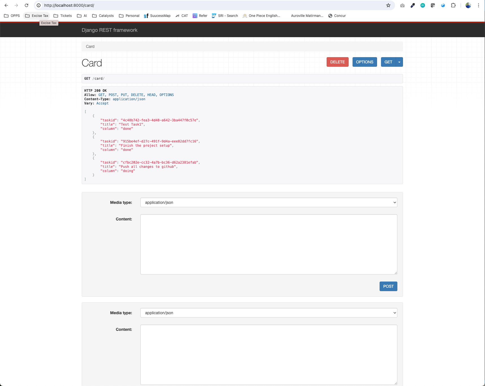
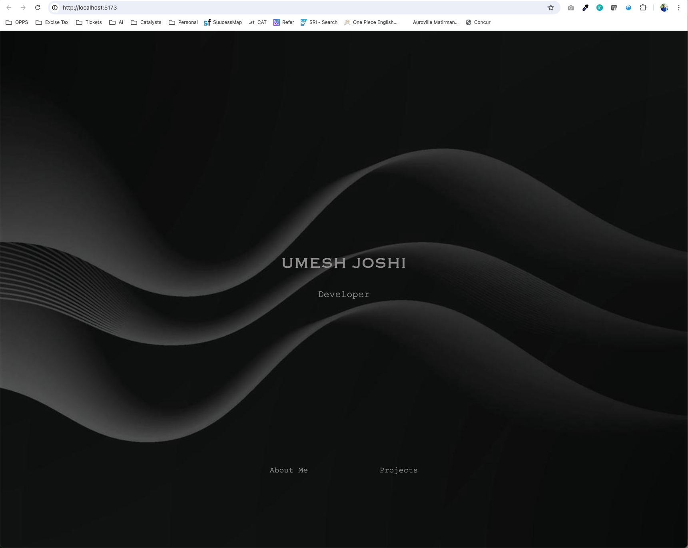
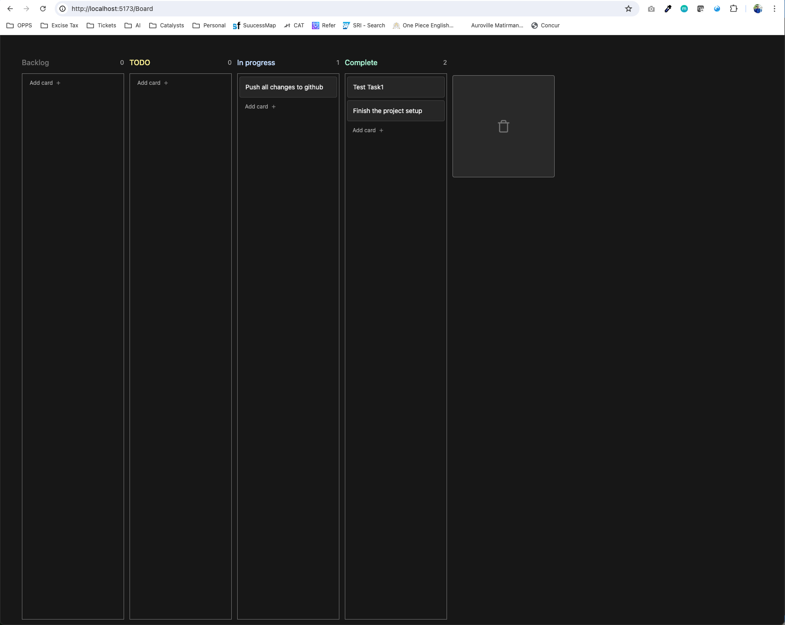

# Kabana

1. To run the django server locally. Go to KabanaBackend/ and execute below command one after the other.

`python manage.py makemigrations`
   
`python manage.py migrate`
 

`python manage.py runserver`

After this you can go to `https://localhost:8000/card` to see the data.

2. To execute the react app, first go Kabana/ and run `npm i`.

Once all the dependency are installed then execute `npm run dev` to run the UI.

Go to `https://localhost:5173/`.

Click on the Projects to see the Kaband application

 

